

# potholesYQR

#### SPOT IT. REPORT IT. FIX IT.

potholesYQR is an enhanced pothole reporting web application for residents of the City of Regina. potholesYQR relies on OpenStreetMaps and the Leaflet.js scripts to provide a visual interface for locating and reporting potholes. The intention is to provide a transparent process for residents to be involved in the reporting and tracking of potholes.

## Screenshots

| Screenshot | Description | Screenshot | Description |
|------------|-------------|------------|-------------|
| <a href="README-assets/potholesYQR-screenshot-Map.png">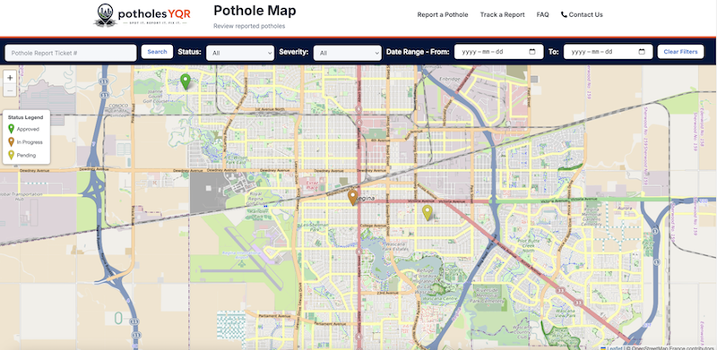</a> | View and search pothole locations | <a href="README-assets/potholesYQR-screenshot-Map-popup.png">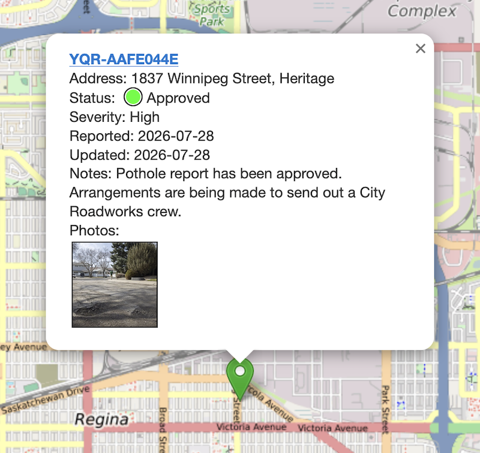</a> | Pothole Report Popup |
| <a href="README-assets/potholesYQR-screenshot-Map-Report.png">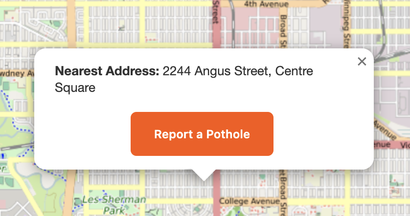</a> | Submit Pothole Report from Map | <a href="README-assets/potholesYQR-screenshot-Report1.png">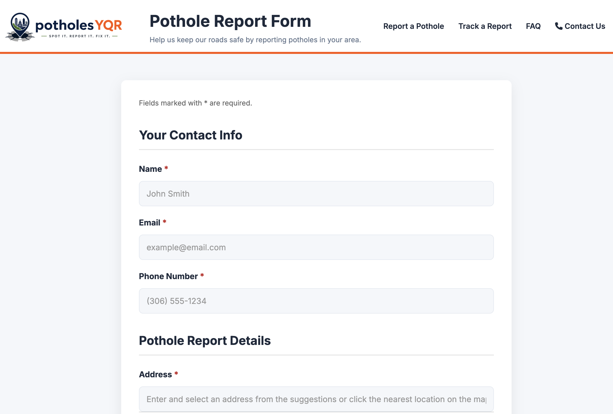</a> | New Pothole Report Form 1 |
| <a href="README-assets/potholesYQR-screenshot-Report2.png">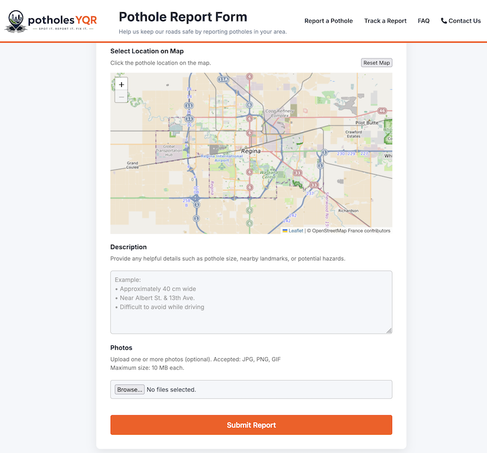</a> | New Pothole Report Form 2 | <a href="README-assets/potholesYQR-screenshot-Report3.png">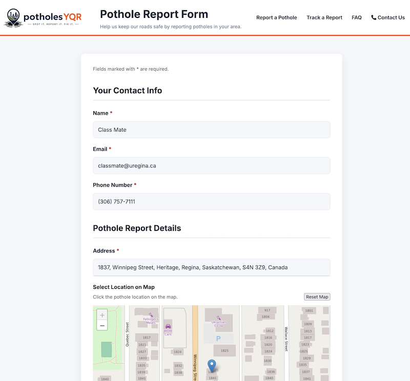</a> | Pothole Report Form Data Entry |
| <a href="README-assets/potholesYQR-screenshot-Report4.png">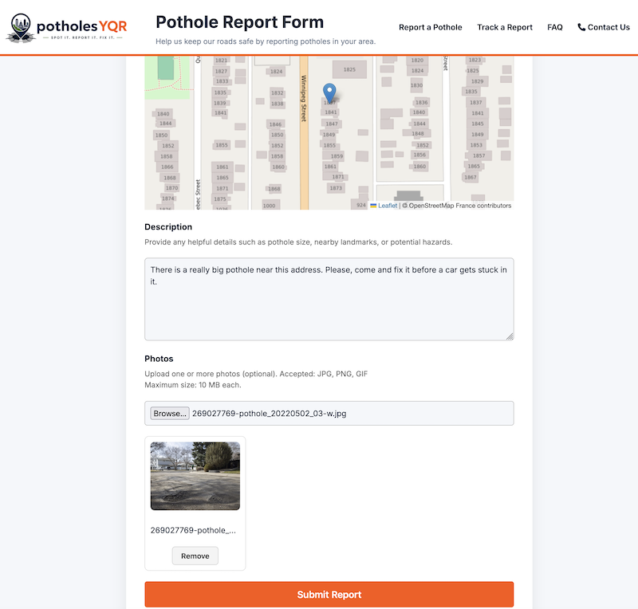</a> | Photo Upload | <a href="README-assets/potholesYQR-screenshot-Report-Confirmation.png">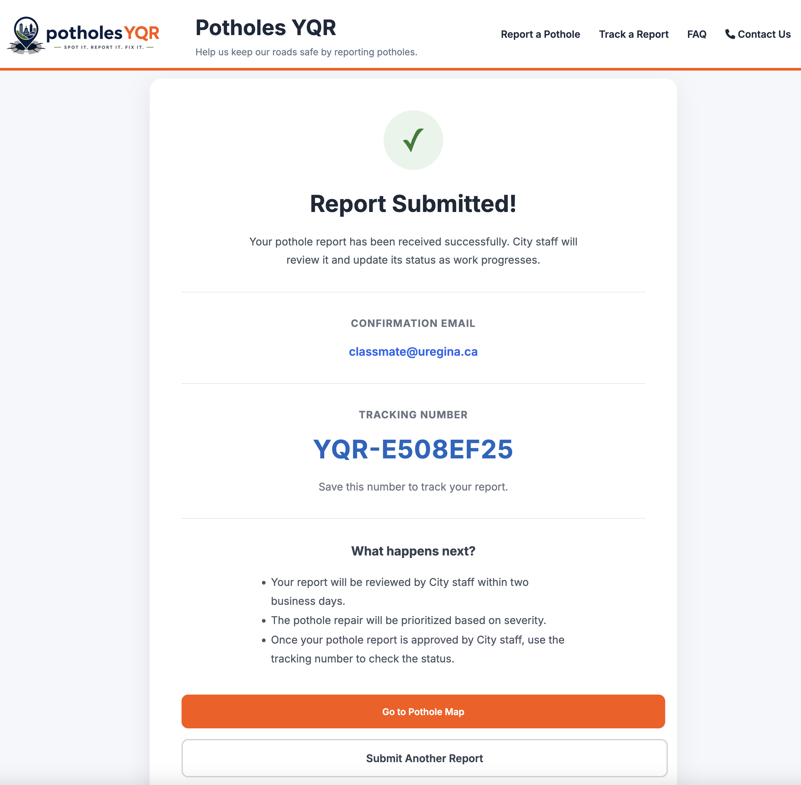</a> | Confirmation |
| <a href="README-assets/potholesYQR-screenshot-Staff-Login.png">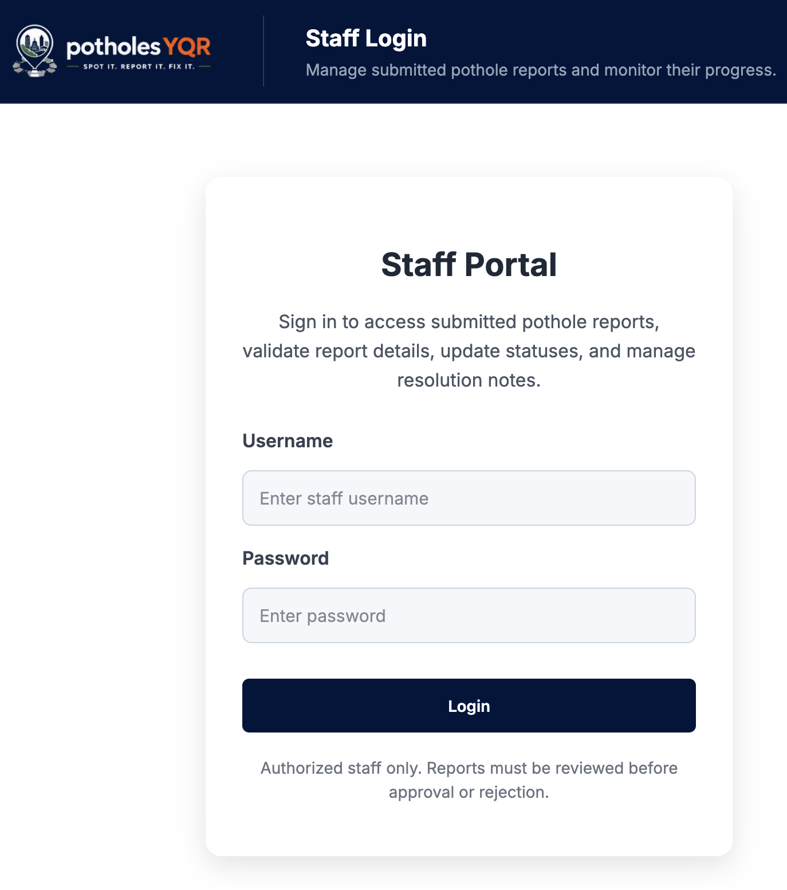</a> | Staff Login | <a href="README-assets/potholesYQR-screenshot-Staff-Dashboard1.png">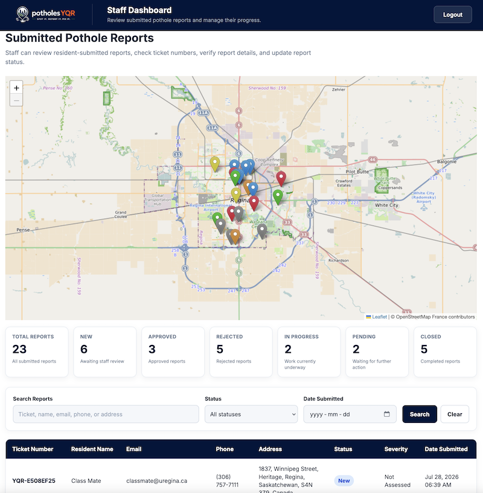</a> | Staff Dashboard |
| <a href="README-assets/potholesYQR-screenshot-Report-Review.png">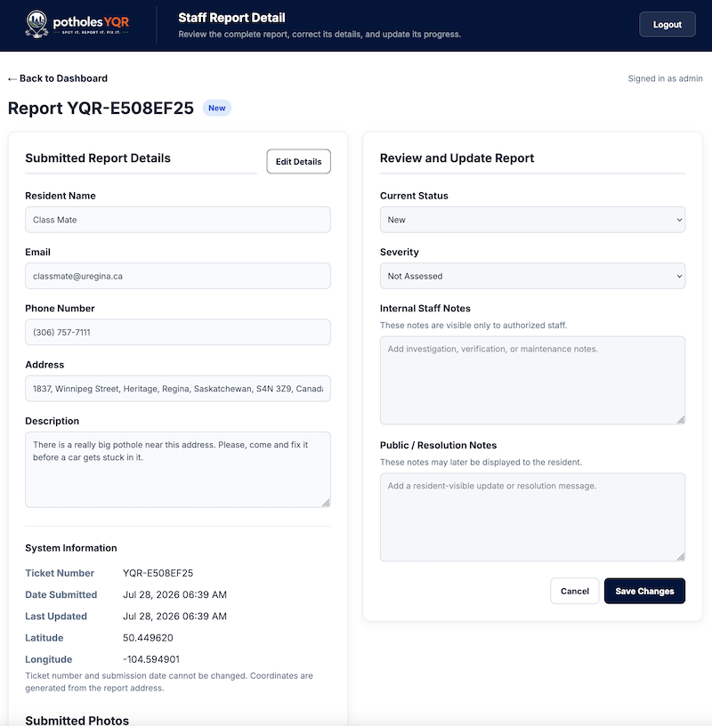</a> | Staff Report Review | <a href="README-assets/potholesYQR-screenshot-Report-Approved.png">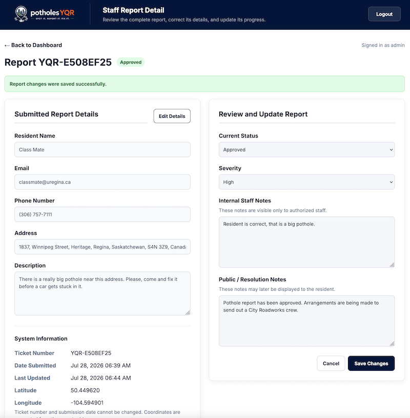</a> | Staff Approval |
| <a href="README-assets/potholesYQR-screenshot-Staff-Dashboard-Search.png">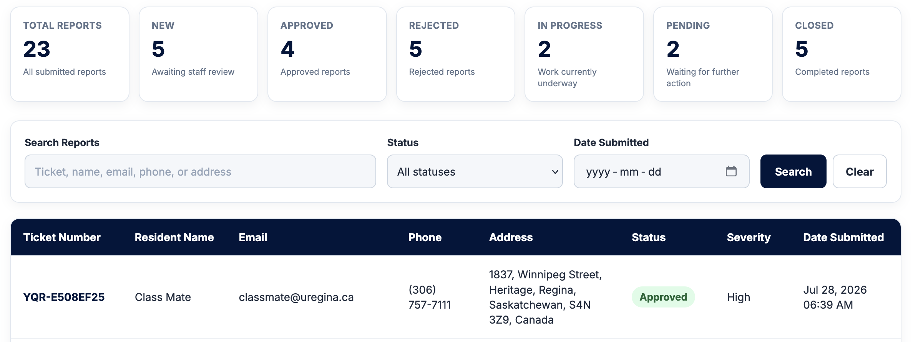</a> | Staff Search and Status Buttons | | |

## Features

| Feature | Description |
|----------|-------------|
| Interactive Map | View and search pothole locations |
| Report Submission | Residents can submit pothole reports |
| Staff Dashboard | Manage report statuses |

The main web page is a resident facing map that allows residents to review the current potholes in the City of Regina. Potholes are shown with different colour pins depending on their status (Approved, In Progress, Pending). Residents are also able to search existing potholes by Report Number, Status, Severity, and date range.

Residents can also use the main interface to initiate new pothole reports. Once they pinpoint the pothole location and provide their contact details along with optional pothole photos, they receive a confirmation message in the browser as well as an email message when the status changes to Approved beyond.

City staff are able to logon to the Staff Dashboard where they can review all current pothole reports. There is a similar search and filter ability along with a map and table of all pothole reports. From this interface, staff are able to create their own pothole reports as well as update existing reports.

## Technology Stack

-  virtual machine hosted by the [Department of Computer Science](https://www.uregina.ca/academics/programs/science/computer-science.html) at the [University of Regina](https://www.uregina.ca)
- 
- 
- 
- 
-   

We have used the Django Model-View-Template (MVT) which is the Django version of the Model-View-Controller (MVC) architecture. The following table illustrates how MVC maps to MVT for the potholesYQR website application:

| MVC | MVT | potholesYQR |
|-----|-----|-------------|
| Model | Model | models.py classes PotholeReport, Photo, Notification, StatusHistory |
| View | Template | Leaflet.js map, staff_dashboard.html, submit_report.html |
| Controller | View | views.py functions submit_report(), staff_login(), staff_dashboard(), etc |

## Installation

We built this project using VS Code and pushed our changes to Github. Once we were satisfied with the code we pulled the repository onto our production web server.

The website can be reached at http://www.student01.cs.uregina.ca/api while connected to the University of Regina's network. Off-campus access requires a [VPN connection](https://www.uregina.ca/is/tech-notes/technote569.html).

The Staff Login is accessed at http://www.student01.cs.uregina.ca/api/staff/login/ (credentials will be provided to the instructor) and once logged in, the Staff Dashboard is accessed at http://www.student01.cs.uregina.ca/api/staff/dashboard.

## Team Members

- [Maria Khalid](https://github.com/marskhld)
- [Dakshkumar Patel](https://github.com/Daksh2429)
- [Opinder Kaur](https://github.com/O-Kaur)
- [Christopher Taylor](https://github.com/taylorc-git)

## Thanks

Thank you to [Brent Zeiben](https://www.uregina.ca/science/computer-science/directory/zeiben-brent.html) of the [RITS](https://www.uregina.ca/is/research-it.html) team at the [University of Regina](https://www.uregina.ca) for all his help with the server setup and willingness to fix things that needed fixing along the way.
